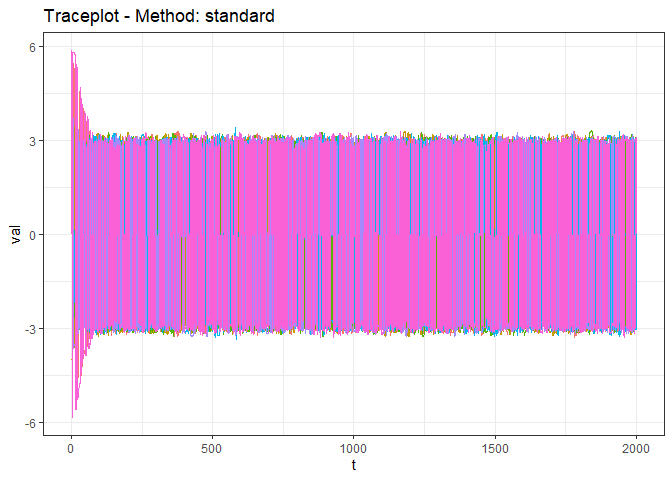
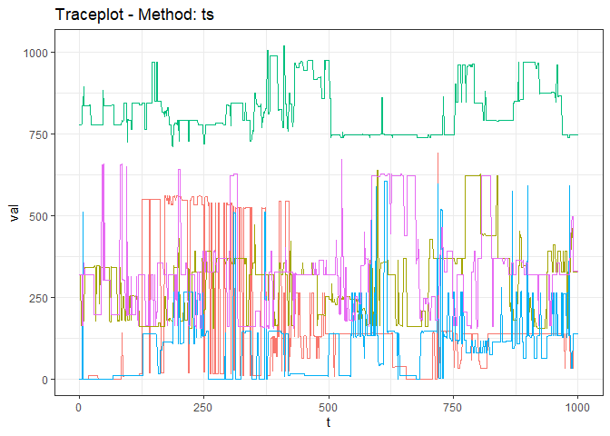

<!-- README.md is generated from README.Rmd. Please edit that file -->

# genMCMCDiag

<!-- badges: start -->

[](https://lifecycle.r-lib.org/articles/stages.html#experimental)
[](https://github.com/LukeDuttweiler/genMCMCDiag/actions/workflows/R-CMD-check.yaml)
<!-- badges: end -->

Determining the convergence of Markov Chain Monte Carlo (MCMC)
algorithms run on highly-dimensional or un-ordered spaces is an active
area of research. This package implements several distance based
algorithms for the creation of diagnostics in these situations. A
forthcoming paper describes the methodology used in detail.

## Installation

``` r
#Install from CRAN
install.packages('genMCMCDiag')

#Install from gitHub
# install.packages("devtools")
devtools::install_github("LukeDuttweiler/genMCMCDiag")
```

## A Simple Example

Consider the results of a multi-chain MCMC algorithm over a univariate
space. The `genMCMCDiag` package provides a simple interface to retrieve
traceplots, the effective sample size (ESS), and the Gelman-Rubin (GR)
diagnostic.

We demonstrate the usage of `genMCMCDiag` in this simple scenario, using
the included simulated MCMC results `uniMCMCResults`. The output of
`genDiagnostic` is a traceplot and tables containing the ESS and GR
results. The method is set to ‘standard’ here as we don’t want to
transform the data prior to running the diagnostics, as it is already
univariate.

``` r
#Load package
library(genMCMCDiag)

#View structure of uniMCMCResults
str(uniMCMCResults)
#> List of 7
#>  $ : num [1:2000] 5.72 5.72 5.72 -5.67 -5.67 ...
#>  $ : num [1:2000] -3.98 -3.98 -3.98 3.81 3.61 ...
#>  $ : num [1:2000] 2.17 2.34 -2.35 -2.35 -2.42 ...
#>  $ : num [1:2000] 0.1266 0.058 0.0436 0.0103 0.0194 ...
#>  $ : num [1:2000] 2 2 2 2 2 ...
#>  $ : num [1:2000] 3.86 -3.74 3.75 3.75 3.75 ...
#>  $ : num [1:2000] 5.87 -5.83 5.81 5.81 5.81 ...

#View Diagnostics
genDiagnostic(uniMCMCResults, method = 'standard')
```



    #> ----------------------------------------------------
    #> Generalized MCMC Diagnostics using standard Method 
    #> ----------------------------------------------------
    #> 
    #> |Effective Sample Size: 
    #> |---------------------------
    #> | Chain 1| Chain 2| Chain 3| Chain 4| Chain 5|  Chain 6|  Chain 7|      Sum|
    #> |-------:|-------:|-------:|-------:|-------:|--------:|--------:|--------:|
    #> | 847.966| 908.501| 885.617|  828.86|  694.21| 1052.483| 1019.646| 6237.283|
    #> 
    #> |Gelman-Rubin Diagnostic: 
    #> |---------------------------
    #> | Point est.| Upper C.I.|
    #> |----------:|----------:|
    #> |      1.014|      1.015|

## A More Complex Example

Consider the results of a more complex multi-chain MCMC algorithm run on
the space of Bayesian network (BN) partitions. The space of BN
partitions does not have a natural distance based order (unlike the
real-line used in the previous example), and so standard traceplots and
MCMC diagnostics cannot be used.

`genMCMCDiag` includes transformation methods to help deal with this
issue, based on a user-supplied (or built in) distance function. In this
instance we will use the built-in `partitionDistance` and the `ts`
transformation method (details to be published in a forthcoming paper),
to view a diagnostic traceplot and transformed calculations of the ESS
and GR diagnostics.

``` r
#View Diagnostics from ts method
genDiagnostic(bnMCMCResults, method = 'ts', distance = partitionDist)
```



    #> ----------------------------------------------------
    #> Generalized MCMC Diagnostics using ts Method 
    #> ----------------------------------------------------
    #> 
    #> |Effective Sample Size: 
    #> |---------------------------
    #> | Chain 1| Chain 2| Chain 3| Chain 4| Chain 5|    Sum|
    #> |-------:|-------:|-------:|-------:|-------:|------:|
    #> |  30.553|  25.257|  18.956|  74.901|  32.204| 181.87|
    #> 
    #> |Gelman-Rubin Diagnostic: 
    #> |---------------------------
    #> | Point est.| Upper C.I.|
    #> |----------:|----------:|
    #> |      2.921|      5.161|

The diagnostic results clearly reveal a complete lack of mixing!
